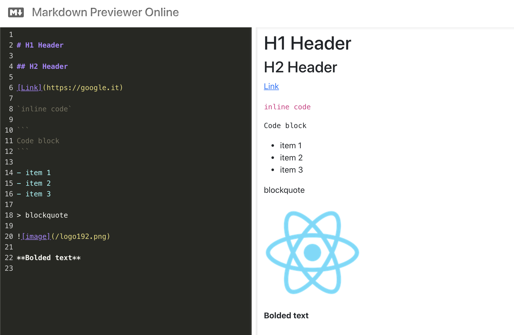

# FRONT END LIBRARIES PROJECT | MARKDOWN PREVIEWER

> This is the second project of _freeCodeCamp "Front End Libraries Projects" Certification_

## HOW TO USE

### 1. Install all dependencies: 
```bash
$ npm install
```

### 2. Run the project in dev mode:
```bash
$ npm start
```

### 3. Open Browser
Open [http://localhost:3000](http://localhost:3000) with your browser to see the result.


## Technology Stack

- **ReactJS**: frontend library (set up with [create-react-app](https://github.com/facebook/create-react-app))
- **Bootstrap**: CSS framework
- **Bootstrap Icons**: official bootstrap icons library
- **SASS**: CSS pre-processors

## SUMMARY

You can use any mix of HTML, JavaScript, CSS, Bootstrap, SASS, React, Redux, and jQuery to complete this project. You should use a frontend framework (like React for example) because this section is about learning frontend frameworks. Happy coding!

### User Stories

|    US    |        Description        |
| :------- | :------------------------ |
| **#1**:  | I can see a textarea element with a corresponding `id="editor"`. |
| **#2**:  | I can see an element with a corresponding `id="preview".` |
| **#3**:  | When I enter text into the `#editor` element, the #preview element is updated as I type to display the content of the textarea. |
| **#4**:  | When I enter GitHub flavored markdown into the `#editor` element, the text is rendered as HTML in the #preview element as I type (HINT: You don't need to parse Markdown yourself - you can import the Marked library for this: https://cdnjs.com/libraries/marked). |
| **#5**:  | When my markdown previewer first loads, the default text in the `#editor` field should contain valid markdown that represents at least one of each of the following elements: a header (H1 size), a sub header (H2 size), a link, inline code, a code block, a list item, a blockquote, an image, and bolded text. |
| **#6**:  | When my markdown previewer first loads, the default markdown in the `#editor` field should be rendered as HTML in the `#preview` element. |
| **#7**:  | ___(Optional Bonus)___ (you do not need to make this test pass): My markdown previewer interprets carriage returns and renders them as `br` (line break) elements. |
